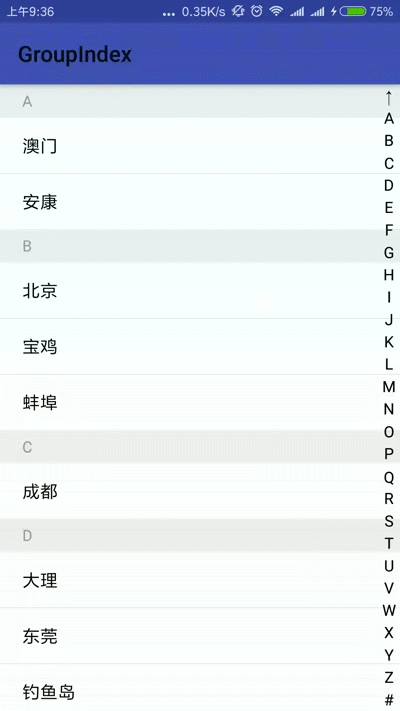
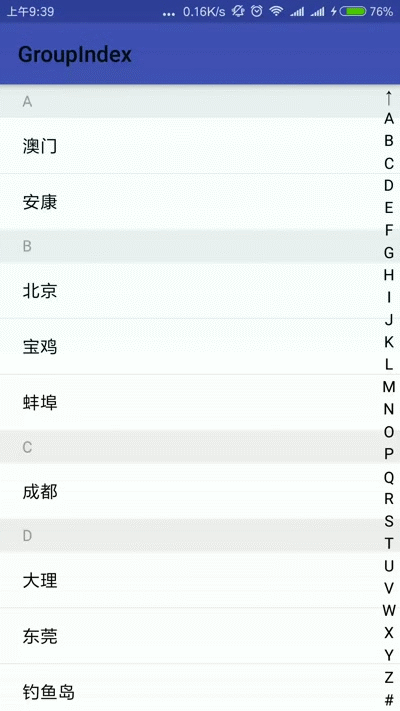

# GroupIndexLib

### 基础效果：
|||
|---|---|
### 基本用法：
**Step 1. 添加JitPack仓库**
在当前项目等根目录下的 `build.gradle` 文件中添加如下内容:
``` gradle
allprojects {
    repositories {
        ...
        maven { url "https://jitpack.io" }
    }
}
```
**Step 2. 添加项目依赖**
``` gradle
dependencies {
        compile 'com.github.Othershe:GroupIndexLib:1.0.0'
}
```
**Step 3.设置ItemDecoration**

```java
//得到tags集合，即对数据源排序后，每个数据会有一个唯一标识字段（tag），然后提取该字段值，组成一个tags集合
//这里提供一个按字母升序排列数据源的方法
//ItemData可以替换为自己的数据Bean
//排序的这部分可以完全自己实现哦，最终的目的只是得到数据源的所有唯一标识字段值集合
SortHelper<ItemData> sortHelper = new SortHelper<ItemData>() {
            @Override
            public String sortField(ItemData data) {
                //用哪个字段的值排序就返回对应字段值
                return data.getTitle();
            }
        };
        //对datas数据集排序
        sortHelper.sortByLetter(datas);
        //提取tag值
        List<String> tags = sortHelper.getTags(datas);

//设置GroupHeader
recyclerView.addItemDecoration(new GroupHeaderItemDecoration(this)
        .setTags(tags)//设置准备好的tags集合
        .setGroupHeaderHeight(30)//设置GroupHeader的高度，单位dp
        .setGroupHeaderLeftPadding(20)//设置GroupHeader左padding，单位dp
        .setGroupHeaderColor("#FFEEEEEE")//设置GroupHeader的背景色
        .setGroupHeaderTextColor("#FF999999")//设置GroupHeader的上的文字颜色
        .setGroupHeaderTextSize(12))//设置GroupHeader上的文字尺寸
        .showSuspensionGroupHeader(flase)////默认显示
        //如果需要自定义绘制GroupHeader，可重写该接口的方法，代码中有例子
        .setOnDrawItemDecorationListener(new OnDrawItemDecorationListener() {
             @Override
             public void onDrawGroupHeader(Canvas c, Paint paint, TextPaint textPaint, int[] params, int position) {

             }

             @Override
             public void onDrawSuspensionGroupHeader(Canvas c, Paint paint, TextPaint textPaint, int[] params, int position) {

             }
        })
    );

//设置分割线
recyclerView.addItemDecoration(new DivideItemDecoration().setTags(tags));
```
**Step 4.使用SideBar**
```java
<com.othershe.groupindexlib.SideBar
        android:id="@+id/side_bar"
        android:layout_width="20dp"
        android:layout_height="match_parent"
        android:layout_alignParentRight="true"
        android:layout_centerVertical="true"
        app:text_color="#000000"
        app:text_size="14"
        app:touch_color="#88999999"
        app:untouch_color="#00FFFFFF" />
```
```java
//设置SideBar上显示的索引字符数组,默认如gif图所示
sideBar.setIndexsArray();
//设置排序后的列表数据源的要在GroupHeader上显示的tags集合、以及SideBar的触摸反馈接口
sideBar.setOnSideBarTouchListener(tags, new OnSideBarTouchListener() {
            @Override
            public void onTouch(String text, int position) {
                //手指触摸
                //text 代表当前手指触摸的字符
                //position 代表RecyclerView将要滚动到的位置，-1代表没找到对应position，则不用滚动列表
                //滚动则使用layoutManager.scrollToPositionWithOffset(position, 0)方法
            }

            @Override
            public void onTouchEnd() {
                //手指触摸结束
            }
        });
```
SideBar相关自定义属性：

|属性名|含义
|---|---|
|text_color| 设置索引字符颜色
|text_size|设置索引字符尺寸（sp）
|touch_color|设置SideBar被触摸时的背景颜色
|untouch_color|设置SideBar默认背景颜色
